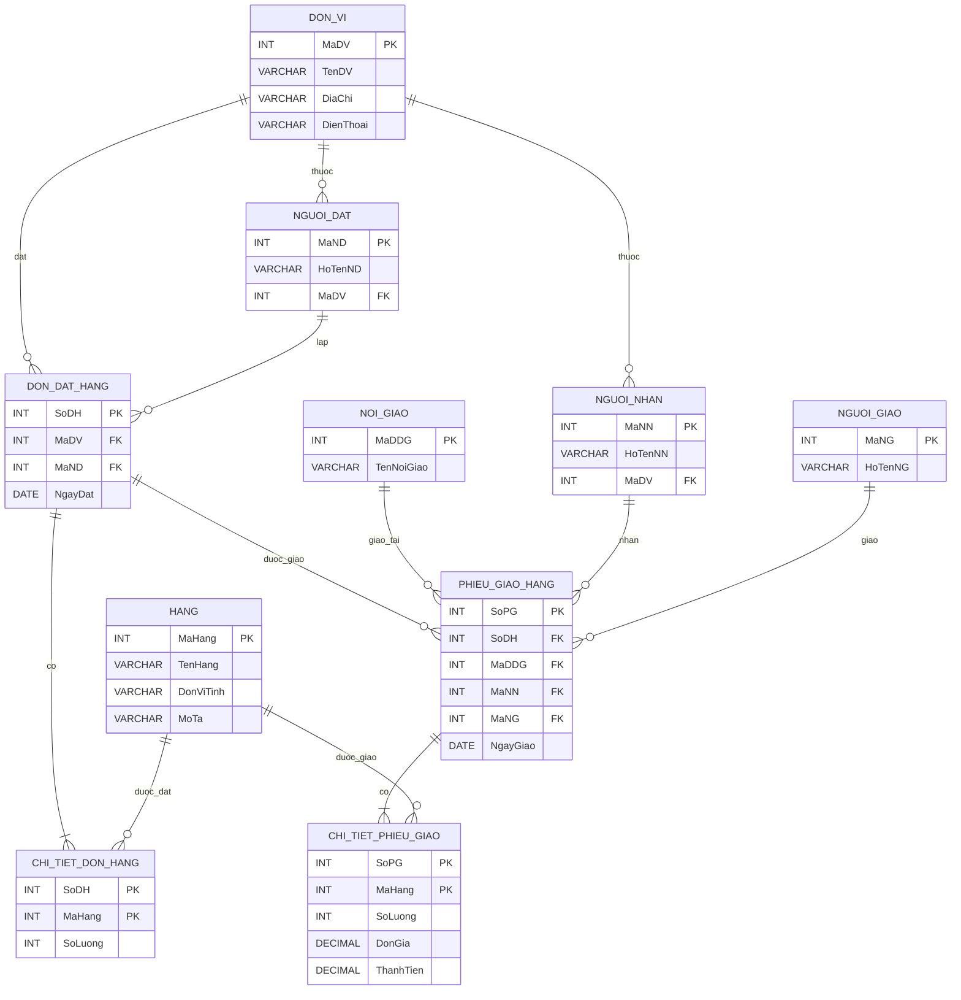

# Bài 1-2: CSDL và quan hệ, thiết kế và tạo CSDL

## 1. Tạo CSDL trên MySQL Workbench

### 1.1. Tạo CSDL bằng giao diện MySQL Workbench

Thực hiện tạo một CSDL mới bằng giao diện MySQL Workbench.


### 1.2. Tạo CSDL bằng câu lệnh SQL

Sử dụng cửa sổ **New Query Tab** trên MySQL Workbench và thực hiện câu lệnh:

```sql
CREATE DATABASE `my_database1`;
```

Câu lệnh trên dùng để tạo một cơ sở dữ liệu mới có tên `my_database1`.

---

## 2. Xóa CSDL trên MySQL Workbench

### 2.1. Xóa CSDL bằng giao diện MySQL Workbench

Chọn Schema cần xóa, click chuột phải và chọn **Drop Schema**, sau đó chọn **Drop Now** để xác nhận.


### 2.2. Xóa CSDL bằng câu lệnh SQL

Sử dụng câu lệnh SQL trên MySQL Workbench:

```sql
DROP DATABASE `my_database1`;
```

Câu lệnh trên dùng để xóa CSDL `my_database1`.

---

## 3. Tạo bảng trên MySQL Workbench

### 3.1. Tạo CSDL `demo`

```sql
CREATE DATABASE demo;
```

### 3.2. Chọn CSDL `demo`

```sql
USE demo;
```

### 3.3. Tạo bảng `Student`

Bảng `Student` gồm các trường:

- `id`: số nguyên
- `name`: chuỗi tối đa 200 ký tự
- `age`: số nguyên
- `country`: chuỗi tối đa 50 ký tự

Câu lệnh SQL:

```sql
CREATE TABLE Student(
    id INT,
    name VARCHAR(200),
    age INT,
    country VARCHAR(50)
);
```

Ảnh minh chứng:


---

## 4. Xây dựng cơ sở dữ liệu quản lý sinh viên

Tiếp tục sử dụng CSDL đã được tạo ở bài thực hành trước.

### 4.1. Tạo bảng `Class`

Bảng `Class` gồm hai trường:

- `id`
- `name`

Câu lệnh SQL:

```sql
CREATE TABLE Class(
    id INT,
    name VARCHAR(200)
);
```

### 4.2. Tạo bảng `Teacher`

Bảng `Teacher` gồm các trường:

- `id`
- `name`
- `age`
- `country`

Câu lệnh SQL:

```sql
CREATE TABLE Teacher(
    id INT,
    name VARCHAR(200),
    age INT,
    country VARCHAR(50)
);
```

Ảnh minh chứng:


---

# 5. Quản lý đơn đặt hàng

## 5.1. Các thực thể

Hệ thống quản lý đơn đặt hàng gồm các thực thể:

- `DON_VI`: Đơn vị khách hàng
- `HANG`: Hàng hóa
- `NGUOI_DAT`: Người đặt hàng
- `NOI_GIAO`: Nơi giao hàng
- `NGUOI_NHAN`: Người nhận hàng
- `NGUOI_GIAO`: Người giao hàng
- `DON_DAT_HANG`: Đơn đặt hàng
- `CHI_TIET_DON_HANG`: Chi tiết đơn đặt hàng
- `PHIEU_GIAO_HANG`: Phiếu giao hàng
- `CHI_TIET_PHIEU_GIAO`: Chi tiết phiếu giao hàng

## 5.2. Khóa chính và khóa ngoại

### DON_VI

- `MaDV`: Khóa chính
- `TenDV`
- `DiaChi`
- `DienThoai`

### HANG

- `MaHang`: Khóa chính
- `TenHang`
- `DonViTinh`
- `MoTa`

### NGUOI_DAT

- `MaND`: Khóa chính
- `HoTenND`
- `MaDV`: Khóa ngoại → `DON_VI(MaDV)`

### NOI_GIAO

- `MaDDG`: Khóa chính
- `TenNoiGiao`

### NGUOI_NHAN

- `MaNN`: Khóa chính
- `HoTenNN`
- `MaDV`: Khóa ngoại → `DON_VI(MaDV)`

### NGUOI_GIAO

- `MaNG`: Khóa chính
- `HoTenNG`

### DON_DAT_HANG

- `SoDH`: Khóa chính
- `MaDV`: Khóa ngoại → `DON_VI(MaDV)`
- `MaND`: Khóa ngoại → `NGUOI_DAT(MaND)`
- `NgayDat`

### CHI_TIET_DON_HANG

Khóa chính tổ hợp:

- `SoDH`
- `MaHang`

Khóa ngoại:

- `SoDH` → `DON_DAT_HANG(SoDH)`
- `MaHang` → `HANG(MaHang)`

Thuộc tính:

- `SoLuong`

### PHIEU_GIAO_HANG

- `SoPG`: Khóa chính
- `SoDH`: Khóa ngoại → `DON_DAT_HANG(SoDH)`
- `MaDDG`: Khóa ngoại → `NOI_GIAO(MaDDG)`
- `MaNN`: Khóa ngoại → `NGUOI_NHAN(MaNN)`
- `MaNG`: Khóa ngoại → `NGUOI_GIAO(MaNG)`
- `NgayGiao`

### CHI_TIET_PHIEU_GIAO

Khóa chính tổ hợp:

- `SoPG`
- `MaHang`

Khóa ngoại:

- `SoPG` → `PHIEU_GIAO_HANG(SoPG)`
- `MaHang` → `HANG(MaHang)`

Thuộc tính:

- `SoLuong`
- `DonGia`
- `ThanhTien`

## 5.3. Sơ đồ ERD



### 5.4. Ảnh ERD


